# E-Protocol - Smart Nutrition & Fitness Tracker

[](https://github.com/julie-raymond-dev/E-Protocol/actions/workflows/deploy.yml)
[](https://julie-raymond-dev.github.io/E-Protocol/)

> Modern React TypeScript application for intelligent nutrition tracking and fitness management with offline-first architecture

## 🛠️ Technical Stack

### Core Technologies
- **React 18.3.1** - Functional components with hooks
- **TypeScript 5.5.3** - Full type safety and enhanced DX
- **Vite 6.3.5** - Lightning-fast build tool
- **Tailwind CSS 3.4.1** - Utility-first styling
- **Auth0** - Secure authentication & authorization

### Data & Storage
- **IndexedDB** - Offline-first data persistence for recipes
- **LocalStorage** - Session management and daily progress
- **Context API** - Global state management
- **Custom Storage Services** - Abstracted data layer

### Build & Development
- **ESLint 9.9.1** - Code quality and consistency
- **PostCSS** - CSS processing
- **GitHub Actions** - CI/CD pipeline
- **Lighthouse CI** - Performance monitoring

## 🏗️ Architecture

### Project Structure
```
src/
├── components/           # React components
│   ├── Dashboard.tsx     # Main app interface
│   ├── UserProfile.tsx   # Profile management
│   ├── MealSelector.tsx  # Meal selection modal
│   ├── RecipeManager.tsx # Recipe CRUD operations
│   └── ...
├── services/            # Business logic
│   ├── userProfileService.ts
│   ├── recipeStorage.ts
│   └── ...
├── utils/               # Utility functions
│   ├── protocolGenerator.ts
│   ├── storage.ts
│   └── ...
├── types/               # TypeScript definitions
├── data/                # Static data
└── hooks/               # Custom React hooks
```

### Key Components

#### Dashboard Component
- **Purpose**: Main application hub with daily tracking
- **Features**: Date navigation, macro visualization, progress tracking
- **State Management**: Complex state with useReducer pattern
- **Performance**: Optimized re-renders with React.memo

#### RecipeManager Component
- **CRUD Operations**: Create, read, update, delete custom recipes
- **Nutritional Calculations**: Automatic macro computation
- **Data Persistence**: IndexedDB storage with error handling
- **Form Validation**: Real-time validation with TypeScript

#### UserProfile Service
- **BMR Calculation**: Mifflin-St Jeor equation implementation
- **TDEE Computation**: Total Daily Energy Expenditure
- **Goal Setting**: Adaptive macro targets based on objectives
- **Data Encryption**: Secure profile storage

### Data Flow

1. **User Authentication** → Auth0 handles login/logout
2. **Profile Loading** → Fetch user data from secure storage
3. **Daily Protocol Generation** → Algorithm creates personalized meal plans
4. **Progress Tracking** → Real-time macro calculations
5. **Data Persistence** → Automatic saving to IndexedDB/LocalStorage

## 🚀 Quick Start

### Prerequisites
```bash
Node.js 18+
npm or yarn
```

### Installation
```bash
git clone https://github.com/julie-raymond-dev/E-Protocol.git
cd E-Protocol
npm install
npm run dev
```

### Environment Setup
```bash
# Copy environment template
cp .env.example .env

# Configure Auth0 credentials
VITE_AUTH0_DOMAIN=your-domain.auth0.com
VITE_AUTH0_CLIENT_ID=your-client-id
VITE_AUTH0_AUDIENCE=your-api-audience
```

### Build & Deploy
```bash
# Production build
npm run build

# Deploy to GitHub Pages
npm run deploy

# Security audit
npm audit
```

## 🔐 Security Features

### Authentication
- **Auth0 Integration** - Enterprise-grade security
- **JWT Tokens** - Secure session management
- **Role-based Access** - User permission system

### Data Protection
- **Client-side Encryption** - Sensitive data protection
- **HTTPS Enforcement** - Secure data transmission
- **Input Validation** - XSS prevention
- **CSRF Protection** - Request validation

### CI/CD Security
- **Automated Security Audits** - npm audit in pipelines
- **Dependency Scanning** - Vulnerability detection
- **Branch Protection** - Secure deployment workflow
- **Secrets Management** - Environment variable protection

## � CI/CD Pipeline

### Pipeline Overview
Our CI/CD pipeline ensures code quality, security, and reliable deployments through a comprehensive 5-stage process:

```mermaid
graph TB
    A[📥 Push/PR] --> B[🧪 Test & Validate]
    B --> C[🔒 Security Audit]
    B --> D[🚦 Performance Check]
    C --> E[🚀 Deploy]
    D --> E
    E --> F[🎉 Live Application]
    
    style A fill:#e1f5fe
    style B fill:#f3e5f5
    style C fill:#ffebee
    style D fill:#e8f5e8
    style E fill:#fff3e0
    style F fill:#e0f2f1
```



### Pipeline Stages

#### 🧪 **Stage 1: Test & Validate**
- **ESLint Analysis** - Code quality and style consistency
- **TypeScript Compilation** - Type safety verification
- **Build Testing** - Ensure production build succeeds
- **Dependency Caching** - Optimized for faster subsequent runs

```yaml
# Triggers on every push and PR
- Checkout code with full git history
- Setup Node.js 18 with npm caching
- Install dependencies with security audit
- Run ESLint validation
- Test production build process
```

#### 🔒 **Stage 2: Security Audit**
- **Vulnerability Scanning** - npm audit for known security issues
- **Dependency Analysis** - Check for outdated or unsafe packages
- **Security Reporting** - Generate detailed security reports
- **Artifact Storage** - Store security reports for 30 days

```yaml
# Runs after successful validation
- Security audit with moderate severity threshold
- Generate JSON security reports
- Upload artifacts for review
- Fail pipeline on high-severity issues
```

#### 🚦 **Stage 3: Performance Check** *(PR only)*
- **Lighthouse CI** - Performance, accessibility, SEO analysis
- **Bundle Size Analysis** - Monitor application size growth
- **Performance Regression Detection** - Compare against baselines
- **GitHub Comments** - Automatic performance reports on PRs

```yaml
# Only for Pull Requests
- Build application for performance testing
- Run Lighthouse CI with custom configuration
- Generate performance metrics
- Comment results on PR
```

#### 🚀 **Stage 4: Deploy** *(main branch only)*
- **Production Build** - Optimized build with environment variables
- **Asset Optimization** - Minification and compression
- **Security Verification** - Final security checks
- **GitHub Pages Deployment** - Automated deployment to production

```yaml
# Only for main branch pushes
- Build with production environment variables
- Verify build integrity and security
- Deploy to GitHub Pages
- Generate deployment summary
```

#### 🤖 **Stage 5: Auto-merge Dependabot** *(optional)*
- **Automated Dependency Updates** - Safe merging of dependency PRs
- **Security-First Approach** - Only merge after all checks pass
- **Maintenance Automation** - Reduce manual maintenance overhead

### Pipeline Configuration

#### **Triggers**
```yaml
# Push to main branch
on:
  push:
    branches: [ main ]
    paths-ignore: ['**.md', '.gitignore', 'LICENSE']

# Pull requests
  pull_request:
    branches: [ main ]
    types: [opened, synchronize, reopened]
```

#### **Security & Permissions**
```yaml
permissions:
  contents: read          # Read repository contents
  pages: write           # Deploy to GitHub Pages
  id-token: write        # OIDC token for secure deployment
  pull-requests: write   # Comment on PRs
  checks: write          # Update check status
```

#### **Environment Variables**
- `VITE_AUTH0_DOMAIN` - Auth0 tenant domain (from GitHub Secrets)
- `VITE_AUTH0_CLIENT_ID` - Auth0 application client ID (from GitHub Secrets)
- `NODE_ENV` - Build environment (production)

### Pipeline Benefits

#### **🔍 Quality Assurance**
- **Zero-defect deployments** - All code passes validation before deployment
- **Consistent code style** - ESLint ensures team coding standards
- **Type safety** - TypeScript prevents runtime errors
- **Security-first** - Automated vulnerability detection

#### **⚡ Performance Optimization**
- **Dependency caching** - Faster build times through smart caching
- **Parallel execution** - Security and performance checks run concurrently
- **Optimized builds** - Minification and tree-shaking for smaller bundles
- **CDN deployment** - GitHub Pages with global CDN distribution

#### **🛡️ Security & Compliance**
- **Secrets management** - Secure handling of sensitive configuration
- **Audit trails** - Complete deployment history and artifact storage
- **Dependency scanning** - Automated security vulnerability detection
- **Branch protection** - Prevents direct pushes to main branch

#### **📊 Monitoring & Reporting**
- **Build status badges** - Real-time pipeline status visibility
- **Performance metrics** - Lighthouse scores and bundle size tracking
- **Security reports** - Detailed vulnerability assessments
- **Deployment summaries** - Complete deployment information

### Development Workflow

#### **🔄 Standard Development Process**
```bash
# 1. Create feature branch
git checkout -b feature/new-feature

# 2. Develop and commit
git add .
git commit -m "feat: add new feature"

# 3. Push and create PR
git push origin feature/new-feature
# Create PR via GitHub UI

# 4. Automated checks run
# - Test & Validate ✅
# - Security Audit ✅  
# - Performance Check ✅

# 5. Review and merge
# Manual review → Merge to main

# 6. Automatic deployment
# - Deploy stage runs
# - Live on GitHub Pages
```

#### **🚨 Emergency Hotfixes**
```bash
# Quick fixes for critical issues
git checkout -b hotfix/critical-fix
# ... make changes ...
git commit -m "fix: critical security patch"
git push origin hotfix/critical-fix
# Fast-track review and merge
```

### Pipeline Monitoring

#### **📈 Key Metrics**
- **Build Success Rate** - Track pipeline reliability
- **Build Duration** - Monitor performance optimization
- **Security Issues Found** - Track vulnerability trends
- **Deployment Frequency** - Development velocity metrics

#### **🔔 Notifications**
- **Slack/Email Integration** - Pipeline status notifications
- **GitHub Checks** - Status checks on PRs and commits
- **Failed Build Alerts** - Immediate notification of failures

#### **📋 Artifacts & Reports**
- **Security Reports** - Stored for 30 days
- **Performance Reports** - Lighthouse CI results
- **Build Logs** - Complete pipeline execution logs
- **Deployment Summaries** - Build size and deployment info

### Troubleshooting

#### **Common Issues**
| Issue | Cause | Solution |
|-------|-------|----------|
| Build Fails | TypeScript/ESLint errors | Fix code issues locally first |
| Security Audit Fails | Vulnerable dependencies | Run `npm audit fix` |
| Performance Regression | Bundle size increase | Analyze and optimize imports |
| Deployment Fails | Missing secrets | Check GitHub repository secrets |

#### **Debug Commands**
```bash
# Local pipeline simulation
npm run lint              # ESLint validation
npm run build            # Production build test
npm audit                # Security audit
npm audit fix            # Fix security issues
```

## �💡 Core Features

### Intelligent Nutrition Tracking
- **Automated Meal Planning** - Date-based rotation algorithm
- **Real-time Macro Calculations** - Live nutritional tracking
- **Custom Recipe Management** - User-defined meals with auto-calculation
- **MET-based Activity Tracking** - Scientific calorie burn estimation

### Advanced Analytics
- **Weekly Performance Reports** - Comprehensive progress analysis
- **Achievement Metrics** - Goal completion tracking
- **Visual Progress Indicators** - Color-coded feedback system
- **Trend Analysis** - Long-term pattern recognition

### Offline-First Design
- **Progressive Web App** - App-like mobile experience
- **IndexedDB Storage** - Reliable offline data persistence
- **Service Worker** - Background sync capabilities
- **Responsive Design** - Cross-device compatibility

## 📊 Performance Metrics

- **Initial Load**: < 2s with caching
- **Bundle Size**: Optimized with tree-shaking
- **Lighthouse Score**: 90+ across all categories
- **Offline Functionality**: 100% feature availability
- **Cross-browser Support**: Modern browsers (ES2020+)

## 🧪 Testing & Quality

### Code Quality
- **ESLint Rules** - Strict TypeScript configuration
- **Type Coverage** - 100% TypeScript implementation
- **Performance Monitoring** - React DevTools profiling
- **Accessibility** - WCAG 2.1 compliance

### CI/CD Pipeline
- **Automated Testing** - ESLint validation
- **Security Scanning** - Vulnerability assessment
- **Performance Testing** - Lighthouse CI integration
- **Deployment Automation** - GitHub Actions workflow

## 🌐 Live Application

**[Access Application](https://julie-raymond-dev.github.io/E-Protocol/)**

### Features Available
- Complete nutrition and fitness tracking
- Real-time macro calculations
- Weekly performance analytics
- Custom recipe management
- Offline functionality
- Responsive mobile interface

## 📝 Contributing

### Development Workflow
1. Fork the repository
2. Create feature branch (`git checkout -b feature/amazing-feature`)
3. Commit changes (`git commit -m 'Add amazing feature'`)
4. Push to branch (`git push origin feature/amazing-feature`)
5. Open Pull Request

### Code Standards
- Follow TypeScript strict mode
- Use functional components with hooks
- Implement proper error handling
- Add comprehensive type definitions
- Follow conventional commit format

## 📄 License

MIT License - see [LICENSE](LICENSE) file for details.

## 🔗 Links

- **Live Demo**: [https://julie-raymond-dev.github.io/E-Protocol/](https://julie-raymond-dev.github.io/E-Protocol/)
- **Repository**: [https://github.com/julie-raymond-dev/E-Protocol](https://github.com/julie-raymond-dev/E-Protocol)
- **Issues**: [https://github.com/julie-raymond-dev/E-Protocol/issues](https://github.com/julie-raymond-dev/E-Protocol/issues)

---

*Built with ❤️ for developers who care about health and code quality*
